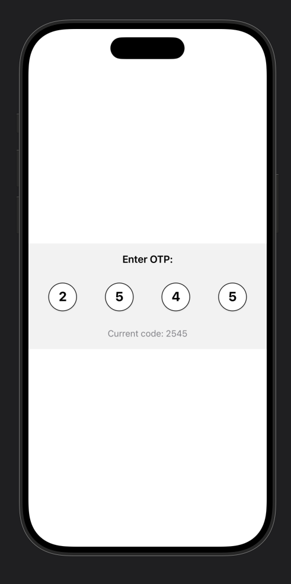

# 🌟 SwiftUI Day2Day


**Your ultimate SwiftUI toolkit** — a collection of reusable, production-ready components and utilities for building beautiful iOS apps effortlessly.  

---

## 🎯 Overview

SwiftUI Day2Day is a **battle-tested Swift Package** designed to speed up your SwiftUI development. Build forms, buttons, selection lists, and more — all consistent, flexible, and ready for production.  

---
## ✨ Features

### 📝 Form Components
- **LabeledTextField** - Text field with label, optional flag, and error handling


- **PhoneTextField** - Phone input with country code picker and validation


- **OTPView** - One-time password input with auto-focus and completion callback


### 🎨 Button Styles
- **MainButtonStyle** - Primary filled button with customizable color
- **OutlinedButtonStyle** - Outlined button with border
- **UnderlinedTextButtonStyle** - Text-only underlined button


### 🔘 Selection Components
- **SelectableItem Protocol** - Protocol for selectable items
- **SelectableView** - Individual selectable item view
- **SingleSelectableView** - Single selection list with search functionality


### 🎭 Styling System
- **AppTextStyle** - Consistent text styling across the app
- **CardModifiers** - White card, outline, and dashed card backgrounds
- **Custom modifiers** for consistent UI

### 🛠 Utilities
- **Binding Extensions** - Unwrap optional bindings with default values
- **Optional Extensions** - Check if optionals are nil or empty
- **SheetContainer** - Reusable sheet presentation container

## 📦 Installation

### Swift Package Manager

Add this package to your project:

1. In Xcode, go to **File → Add Packages...**
2. Enter the repository URL
3. Select version rules
4. Add to your target

Or add to your `Package.swift`:

```swift
dependencies: [
    .package(url: "https://github.com/yourusername/SwiftUIDay2Day.git", from: "1.0.0")
]
```

## 🚀 Usage Examples

### Text Field

```swift
import SwiftUIDay2Day

struct ContentView: View {
    @State private var name = ""
    @State private var nameError: String?
    
    var body: some View {
        LabeledTextField(
            text: $name,
            errorMessage: $nameError,
            placeHolder: "Enter your name",
            label: "Full Name",
            image: Image(systemName: "person")
        )
    }
}
```

### Phone Field

```swift
@State private var countries: [CountryEntity] = [
    CountryEntity(id: 1, name: "Saudi Arabia", callingCode: "+966", flag: "🇸🇦"),
    CountryEntity(id: 2, name: "United States", callingCode: "+1", flag: "🇺🇸")
]
@State private var phoneNumber: String?
@State private var countryCode: String?

PhoneTextField(
    items: $countries,
    phone: $phoneNumber,
    countryCode: $countryCode,
    errorMessage: $phoneError
)
```

### OTP Field

```swift
@State private var otpCode = ""

OTPView(code: $otpCode, digits: 4) {
    print("OTP completed: \(otpCode)")
}
```

### Buttons

```swift
// Main button
Button("Continue") {
    // Action
}
.mainButton()

// Outlined button
Button("Skip") {
    // Action
}
.outlinedButton()

// Underlined text button
Button("Forgot Password?") {
    // Action
}
.underlinedTextButton()
```

### Text Styling

```swift
Text("Welcome")
    .appText(.titleLarge)

Text("Subtitle")
    .appText(.bodyRegular, color: .gray)

Text("Caption")
    .appText(.caption)
```

### Card Backgrounds

```swift
VStack {
    Text("Content")
}
.padding()
.whiteCardBackground()

VStack {
    Text("Outlined")
}
.padding()
.outlineCard()
```

### Selection List

```swift
@State private var items: [YourSelectableItem] = [...]
@State private var selectedItem: YourSelectableItem?

SingleSelectableView(
    items: $items,
    selectedItem: $selectedItem
)
```

## 📋 Requirements

- iOS 15.0+
- Swift 5.7+
- Xcode 13.0+

## 🏗 Architecture

The package is organized into logical modules:

```
SwiftUIDay2Day/
├── Components/
│   ├── Forms/          # Input components
│   ├── Buttons/        # Button styles
│   ├── Selection/      # Selection components
│   └── Media/          # Media components
├── Styles/             # Visual styling
├── Utilities/          # Helper extensions
└── Models/             # Data models
```

## 🎨 Design Philosophy

- **Consistency** - Unified design language across all components
- **Flexibility** - Highly customizable with sensible defaults
- **Accessibility** - Built with accessibility in mind
- **Performance** - Optimized for smooth 60fps animations
- **Type Safety** - Leverages Swift's type system

## 🤝 Contributing

Contributions are welcome! Please feel free to submit a Pull Request.

## 👨‍💻 Author

Created by Abdallah Edres

## 🙏 Acknowledgments

- Built with SwiftUI
- Uses Kingfisher for image loading

---

**Note**: This is a component library. Import it into your iOS project to use the components.
# SwiftUIDay2Day
